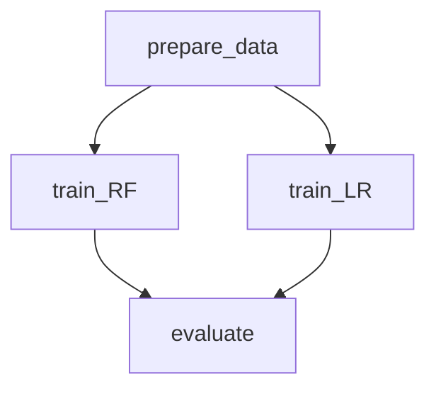

# DVC Project Design Patterns (WIP)

## Installation

```bash
python -m venv .venv
source .venv/bin/activate
pip install -r requirements.txt
export PYTHONPATH=$PWD
```

## Patterns

### 1 - Pipelines

#### Parallel Stages (training)

> Example: [pipelines/parallel-stages](pipelines/parallel-stages)

In Data Version Control (DVC), the concept of "Parallel Stages" refers to a design pattern where multiple stages of a pipeline are executed concurrently, rather than sequentially. This approach is particularly useful when you have stages that are independent of each other and can be run simultaneously, thereby improving the efficiency and reducing the overall runtime of your pipeline.



> Notes:
>
> - This example assumes that parallel stages are running on the same machine.
