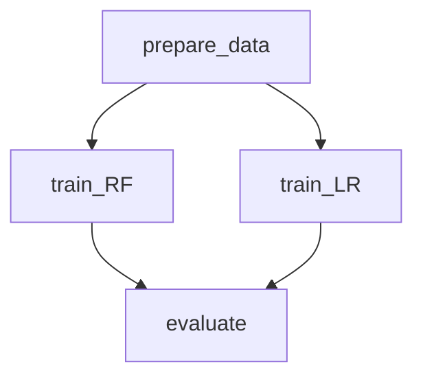

# DVC Project Design Patterns (WIP)

## Introduction

Welcome to the "DVC Project Design Patterns" community project! This initiative is dedicated to exploring, documenting, and sharing best practices and design patterns for using [Data Version Control (DVC)](https://dvc.org/doc), an open-source tool for managing and versioning data and machine learning models.

### What You Will Find Here

- Design Pattern Catalogue: A collection of design patterns for common scenarios encountered in machine learning projects, such as handling large datasets, managing experiments, and parallel processing.
- Best Practices: Tips and tricks for optimizing DVC workflows, managing dependencies, and ensuring reproducibility.
- Real-World Examples: Practical implementations of these patterns in real-world projects, demonstrating their application and benefits.

### Who Should Participate

- Data Scientists & ML Engineers: Improve your workflow with efficient DVC practices.
- Team Leads & Managers: Understand how to structure ML projects for better manageability and collaboration.
- Open Source Enthusiasts: Contribute by sharing your own experiences, patterns, and best practices.

## Installation

```bash
python -m venv .venv
source .venv/bin/activate
pip install -r requirements.txt
export PYTHONPATH=$PWD
```

## Patterns

### 1 - Pipelines

#### Parallel Stages (training)

> Example: [pipelines/parallel-stages](pipelines/parallel-stages)

In Data Version Control (DVC), the concept of "Parallel Stages" refers to a design pattern where multiple stages of a pipeline are executed concurrently, rather than sequentially. This approach is particularly useful when you have stages that are independent of each other and can be run simultaneously, thereby improving the efficiency and reducing the overall runtime of your pipeline.



> Notes:
>
> - This example assumes that parallel stages are running on the same machine.
> - This pattern can be applied to any stage of a pipeline, not just training.

## Contributing

This is a community-driven project, and your contributions are vital to its success. You can contribute in several ways:

Share a Pattern: Document a design pattern you've found useful in your projects.
Contribute with Examples: Implement an existing pattern in a new context and share your findings.
Improve Documentation: Help refine the explanations, add clarity, or fix errors.
Spread the Word: Share this project with your network to grow the community.
