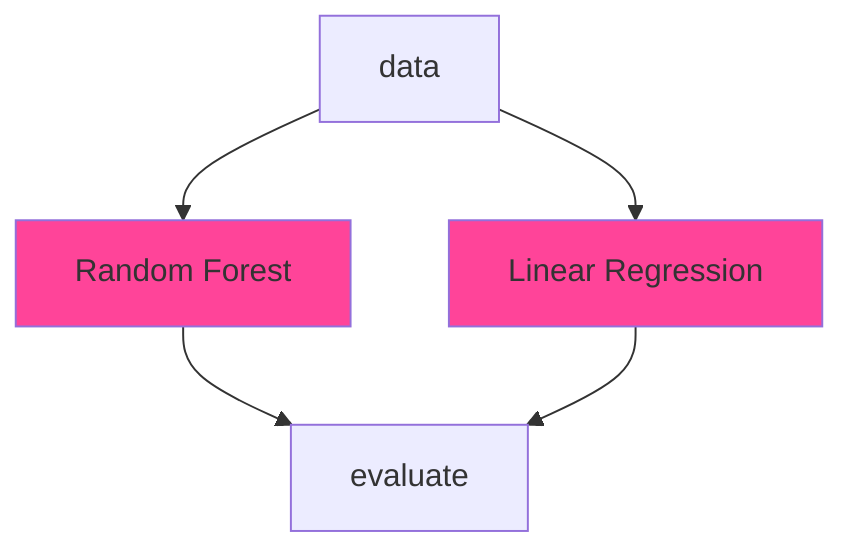
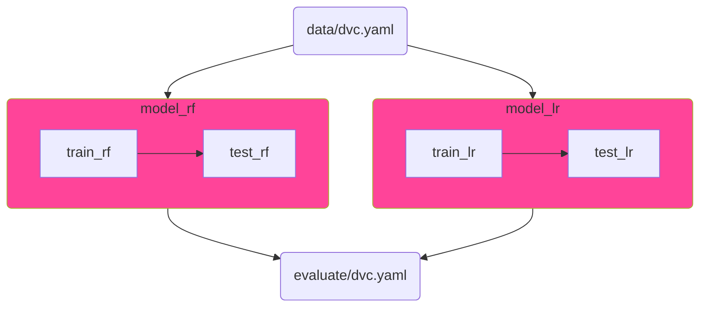

# DVC Project Design Patterns (WIP)

## Introduction

Welcome to the "DVC Project Design Patterns" community project! This initiative is dedicated to exploring, documenting, and sharing best practices and design patterns for using [Data Version Control (DVC)](https://dvc.org/doc), an open-source tool for managing and versioning data and machine learning models.

### What You Will Find Here

- Design Pattern Catalogue: A collection of design patterns for common scenarios encountered in machine learning projects, such as handling large datasets, managing experiments, and parallel processing.
- Best Practices: Tips and tricks for optimizing DVC workflows, managing dependencies, and ensuring reproducibility.
- Real-World Examples: Practical implementations of these patterns in real-world projects, demonstrating their application and benefits.

### Who Should Participate

- Data Scientists & ML Engineers: Improve your workflow with efficient DVC practices.
- Team Leads & Managers: Understand how to structure ML projects for better manageability and collaboration.
- Open Source Enthusiasts: Contribute by sharing your own experiences, patterns, and best practices.

## Installation

```bash
python -m venv .venv
source .venv/bin/activate
pip install -r requirements.txt
export PYTHONPATH=$PWD
```

## Patterns

### 1 - Parallel Stages

| Pattern | Description | Example |
| --- | --- | --- |
| Parallel Stages | Run multiple independed stages of a pipeline concurrently | [pipelines/parallel-stages](pipelines/parallel-stages) |



### 2 - Parallel Pipelines

| Pattern | Description | Example |
| --- | --- | --- |
| Parallel Pipelines | Run multiple pipelines concurrently | [pipelines/parallel-pipelines](pipelines/parallel-pipelines) |



## Contributing

This is a community-driven project, and your contributions are vital to its success. You can contribute in several ways:

Share a Pattern: Document a design pattern you've found useful in your projects.
Contribute with Examples: Implement an existing pattern in a new context and share your findings.
Improve Documentation: Help refine the explanations, add clarity, or fix errors.
Spread the Word: Share this project with your network to grow the community.
