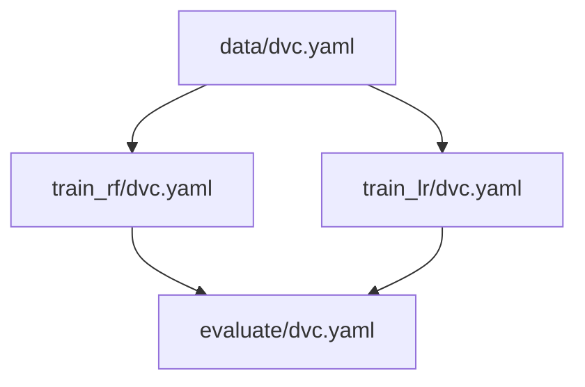

# Parallel Pipelines

> Example: [pipelines/parallel-pipelines](pipelines/parallel-pipelines)
> 



> Notes:
>
> - This example assumes that parallel stages are running on the same machine.
> - This pattern can be applied to any stage of a pipeline, not just training.


## Run

Run pipelines consequently:

```bash
dvc repro pipelines/data/dvc.yaml
dvc repro pipelines/train_rf/dvc.yaml -f
dvc repro pipelines/train_lr/dvc.yaml -f
dvc repro pipelines/evaluate/dvc.yaml
```

Run pipelines model training in parallel:

```bash
dvc repro pipelines/data/dvc.yaml
dvc repro pipelines/train_rf/dvc.yaml -f & dvc repro pipelines/train_lr/dvc.yaml -f
dvc repro pipelines/evaluate/dvc.yaml
```
