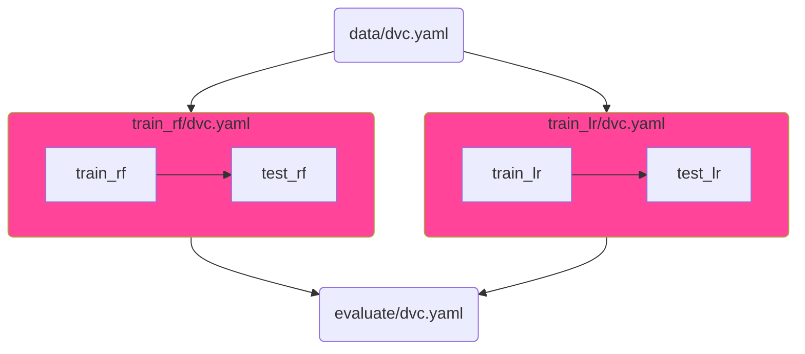

# Parallel Pipelines

> Example: [pipelines/parallel-pipelines](pipelines/parallel-pipelines)

In Data Version Control (DVC), the concept of "Parallel Pipelines" refers to a design pattern where multiple pipelines are executed concurrently, rather than sequentially. This approach is particularly useful when you have **multiple-stage pipelines** that are independent of each other and can be run simultaneously.



> Notes:
>
> - This example assumes that parallel stages are running on the same machine.
> - This pattern can be applied to any stage of a pipeline, not just training.

## Run

Run pipelines consequently:

```bash
dvc repro pipelines/data/dvc.yaml -f
dvc repro pipelines/train_rf/dvc.yaml
dvc repro pipelines/train_lr/dvc.yaml
dvc repro pipelines/evaluate/dvc.yaml
```

Run pipelines model training in parallel:

```bash
dvc repro pipelines/data/dvc.yaml -f
dvc repro -s pipelines/train_rf/dvc.yaml -f & dvc repro -s pipelines/train_lr/dvc.yaml -f
dvc repro pipelines/evaluate/dvc.yaml
```
