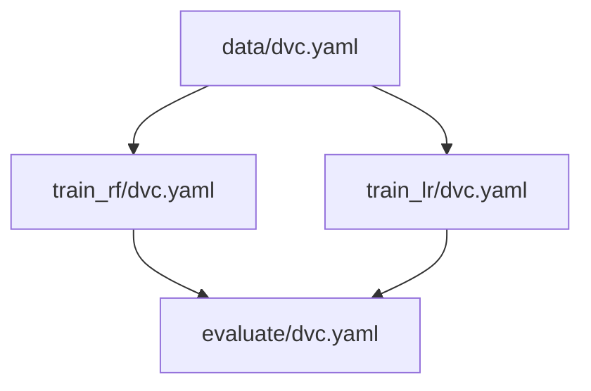

# Parallel Pipelines

> Example: [pipelines/parallel-pipelines](pipelines/parallel-pipelines)

In Data Version Control (DVC), the concept of "Parallel Stages" refers to a design pattern where multiple stages of a pipeline are executed concurrently, rather than sequentially. This approach is particularly useful when you have stages that are independent of each other and can be run simultaneously, thereby improving the efficiency and reducing the overall runtime of your pipeline.



> Notes:
>
> - This example assumes that parallel stages are running on the same machine.
> - This pattern can be applied to any stage of a pipeline, not just training.


## Run

Run pipelines consequently:

```bash
dvc repro pipelines/data/dvc.yaml
dvc repro pipelines/train_rf/dvc.yaml -f
dvc repro pipelines/train_lr/dvc.yaml -f
dvc repro pipelines/evaluate/dvc.yaml
```

Run pipelines model training in parallel:

```bash
dvc repro pipelines/data/dvc.yaml
dvc repro pipelines/train_rf/dvc.yaml -f & dvc repro pipelines/train_lr/dvc.yaml -f
dvc repro pipelines/evaluate/dvc.yaml
```
