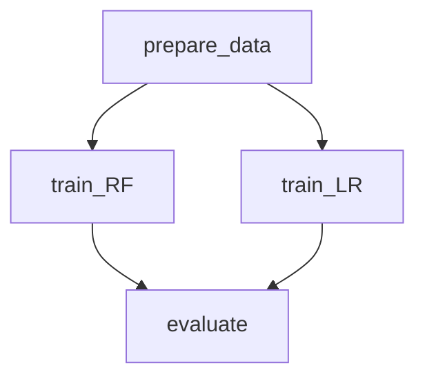

#### Parallel Stages (training)

> Example: [pipelines/parallel-stages](pipelines/parallel-stages)

In Data Version Control (DVC), the concept of "Parallel Stages" refers to a design pattern where multiple stages of a pipeline are executed concurrently, rather than sequentially. This approach is particularly useful when you have stages that are independent of each other and can be run simultaneously, thereby improving the efficiency and reducing the overall runtime of your pipeline.



Run

```bash

dvc repro train_RF -f && dvc repro train_LR -f 
dvc exp run train_RF -f && dvc exp run train_LR -f 
dvc repro evaluate -f 
```

```mermaid
```

> Notes:
>
> - This example assumes that parallel stages are running on the same machine.
> - This pattern can be applied to any stage of a pipeline, not just training.
